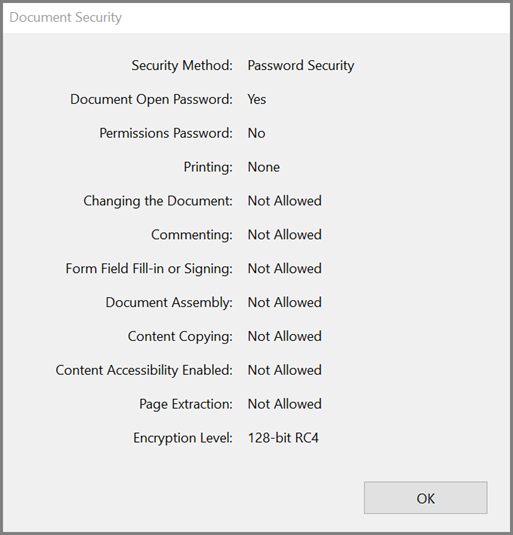
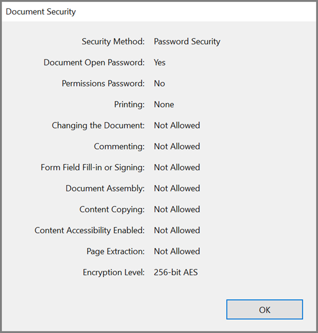
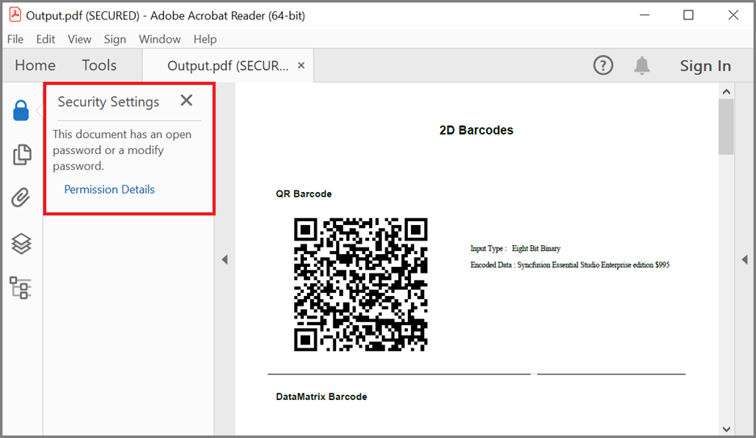
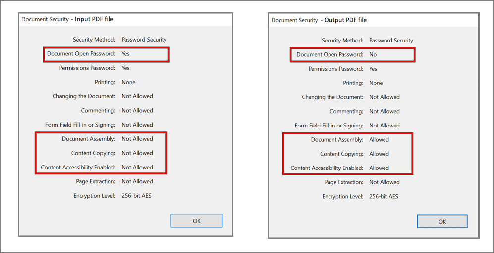
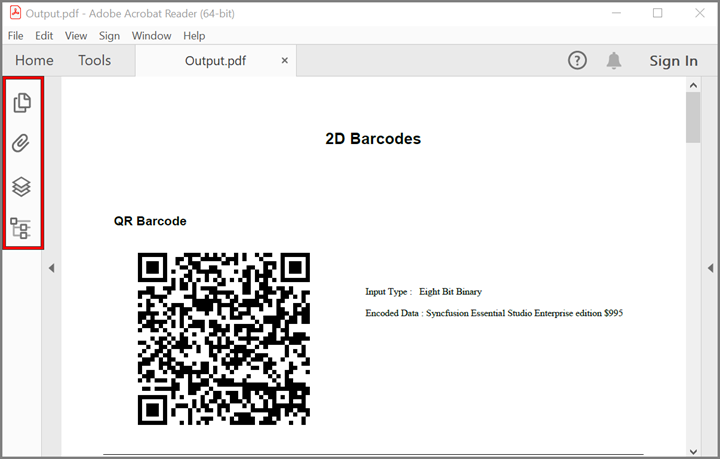

# Securing PDF documents in C# with the Syncfusion .NET PDF Library 

A secure PDF document created with Syncfusion undergoes enhancements and fortification through the implementation of various security measures and features provided by Syncfusion. The repository includes examples for encrypting or decrypting PDF documents, altering password or permissions for PDF documents, safeguarding attachments, and removing passwords from PDF documents. Some of the use cases that we will cover in this article include:

* Encrypt PDF document with user password 
* Encrypt PDF document with owner password 
* Protect an existing PDF document 
* Change the password of the PDF document 
* Change the permission of the PDF document 
* Protect attachments in an existing PDF document 
* Remove password from PDF document 

Sample name | Description
--- | ---
[Encrypt PDF with user password]() | Encrypt PDF document with user password. 
[Encrypt PDF with owner password]() | Encrypt PDF document with owner password.
[Protect an existing PDF]() | Protect an existing PDF document.
[Change password of PDF]() | Change password of the PDF document. 
[Change permission of PDF]() | Change the permission of the PDF document. 
[Protect attachments]() | Protect attachments in an existing PDF document. 
[Remove password from PDF]() | Remove password from an existing PDF document. 

## Encrypt PDF document with user password  

By setting a User Password for a PDF document, you can prevent unauthorized individuals from opening or viewing it.  

```csharp

//Create a new PDF document.
PdfDocument document = new PdfDocument();
//Add a page to the document.
PdfPage page = document.Pages.Add();
//Create PDF graphics for the page.
PdfGraphics graphics = page.Graphics;

//Create instance of document security.
PdfSecurity security = document.Security;
//Specifies key size, encryption algorithm and user password.
security.KeySize = PdfEncryptionKeySize.Key128Bit;
security.Algorithm = PdfEncryptionAlgorithm.RC4;
security.UserPassword = "password";
//Draw the text.
graphics.DrawString("Encryp PDF with user password and RC4 128bit keysize", new PdfStandardFont(PdfFontFamily.TimesRoman, 20f, PdfFontStyle.Bold), PdfBrushes.Black, new PointF(0, 40));

//Save the document into stream.
MemoryStream stream = new MemoryStream();
document.Save(stream);
//Close the document.
document.Close(true);

```

By executing the program, you will get the PDF document's security settings as follows. 


## Encrypt PDF document with owner password  

By setting the owner password, you can establish various PDF document restrictions, such as printing, content copying, editing, page extracting, commenting, and more.  

```csharp

//Create a new PDF document.
PdfDocument document = new PdfDocument();
//Add a page to the document.
PdfPage page = document.Pages.Add();
//Create PDF graphics for the page.
PdfGraphics graphics = page.Graphics;

//Create instance of document security.
PdfSecurity security = document.Security;
//Specifies key size, encryption algorithm and user password.
security.KeySize = PdfEncryptionKeySize.Key256Bit;
security.Algorithm = PdfEncryptionAlgorithm.AES;
security.UserPassword = "Syncfusion";
//Draw the text.
graphics.DrawString("This document protected with owner password", new PdfStandardFont(PdfFontFamily.TimesRoman, 20f, PdfFontStyle.Bold), PdfBrushes.Black, new PointF(0, 40));

//Save the document into stream.
MemoryStream stream = new MemoryStream();
document.Save(stream);
//Close the document.
document.Close(true);

```

By executing the program, you will get the PDF document's security settings as follows. 


## Protect an existing PDF document 
With the help of our Syncfusion PDF library, you can easily protect an existing PDF document. 

```csharp

//Load the PDF document.
FileStream docStream = new FileStream("Input.pdf", FileMode.Open, FileAccess.Read);
PdfLoadedDocument document = new PdfLoadedDocument(docStream);

//PDF document security.
PdfSecurity security = document.Security;
//Specifies encryption key size, algorithm, and permission. 
security.KeySize = PdfEncryptionKeySize.Key256Bit;
security.Algorithm = PdfEncryptionAlgorithm.AES;
//Provide owner and user password.
security.OwnerPassword = "ownerPassword256";
security.UserPassword = "userPassword256";

//Save the document into stream.
MemoryStream stream = new MemoryStream();
document.Save(stream);
//Close the document.
document.Close(true);

```

By executing this code example, you will get a PDF document like the following screenshot.  


## Change the password of the PDF document 
Updating the password of a PDF document is an essential step in ensuring document security and controlling access. Syncfusion simplifies this process, allowing you to effortlessly modify both the user password and owner password of the PDF document. 

```csharp

//Load an existing PDF document.
FileStream docStream = new FileStream("Input.pdf", FileMode.Open, FileAccess.Read);
PdfLoadedDocument loadedDocument = new PdfLoadedDocument(docStream, "ownerPassword256");
//Change the user password.
loadedDocument.Security.UserPassword = "NewUserPassword";
//Change the owner password.
loadedDocument.Security.OwnerPassword = "NewOwnerPassword";

//Save the document into stream.
MemoryStream stream = new MemoryStream();
loadedDocument.Save(stream);
//Close the document.
loadedDocument.Close(true);

```

## Change the permission of the PDF document 

Syncfusion empowers you to effortlessly modify permissions for a PDF document, providing complete control over access, editing, printing, and other operations performed on the file.  

```csharp

//Load the PDF document.
FileStream docStream = new FileStream("Input.pdf", FileMode.Open, FileAccess.Read);
PdfLoadedDocument loadedDocument = new PdfLoadedDocument(docStream, "ownerPassword256");
//Change the permission.
loadedDocument.Security.Permissions = PdfPermissionsFlags.CopyContent | PdfPermissionsFlags.AssembleDocument;

//Save the document into stream
MemoryStream stream = new MemoryStream();
loadedDocument.Save(stream);
//Close the PDF document
loadedDocument.Close(true);

```

By executing this code example, you will get a PDF document with permission as like the following screenshot.  


## Protect attachments in an existing PDF document 

Syncfusion seamlessly provides the necessary capabilities to encrypt attachments with strong passwords, ensuring added authenticity. 

```csharp

//Load the PDF document.
FileStream docStream = new FileStream("Input.pdf", FileMode.Open, FileAccess.Read);
PdfLoadedDocument document = new PdfLoadedDocument(docStream);

//PDF document security.
PdfSecurity security = document.Security;
//Specifies encryption key size, algorithm and permission.
security.KeySize = PdfEncryptionKeySize.Key256Bit;
security.Algorithm = PdfEncryptionAlgorithm.AES;
//Provide user password.
security.UserPassword = "password";
//Specifies encryption option.
security.EncryptionOptions = PdfEncryptionOptions.EncryptOnlyAttachments;

//Save the document into stream.
MemoryStream stream = new MemoryStream();
document.Save(stream);
//Close the document.
document.Close(true);

```

## Remove password from PDF document 

Syncfusion simplifies the process of accessing and modifying secured files by effortlessly removing passwords from PDF documents. 

```csharp

//Load the PDF document.
FileStream docStream = new FileStream("Input.pdf", FileMode.Open, FileAccess.Read);
PdfLoadedDocument loadedDocument = new PdfLoadedDocument(docStream, "password");
//Change the user password.
loadedDocument.Security.OwnerPassword= string.Empty;

//Save the document into stream.
MemoryStream stream = new MemoryStream();
loadedDocument.Save(stream);
//Close the document.
loadedDocument.Close(true);

```

By executing this code example, you will be able to remove the protection from a PDF document. The resulting PDF document will not have any password protection and can be freely opened, edited, and printed.


# How to run the examples
* Download this project to a location in your disk. 
* Open the solution file using Visual Studio. 
* Rebuild the solution to install the required NuGet package. 
* Run the application.

# Resources
*   **Product page:** [Syncfusion PDF Framework](https://www.syncfusion.com/document-processing/pdf-framework/net)
*   **Documentation page:** [Syncfusion .NET PDF library](https://help.syncfusion.com/file-formats/pdf/overview)
*   **Online demo:** [Syncfusion .NET PDF library - Online demos](https://ej2.syncfusion.com/aspnetcore/PDF/CompressExistingPDF#/bootstrap5)
*   **Blog:** [Syncfusion .NET PDF library - Blog](https://www.syncfusion.com/blogs/category/pdf)
*   **Knowledge Base:** [Syncfusion .NET PDF library - Knowledge Base](https://www.syncfusion.com/kb/windowsforms/pdf)
*   **EBooks:** [Syncfusion .NET PDF library - EBooks](https://www.syncfusion.com/succinctly-free-ebooks)
*   **FAQ:** [Syncfusion .NET PDF library - FAQ](https://www.syncfusion.com/faq/)

# Support and feedback
*   For any other queries, reach our [Syncfusion support team](https://www.syncfusion.com/support/directtrac/incidents/newincident?utm_source=github&utm_medium=listing&utm_campaign=github-docio-examples) or post the queries through the [community forums](https://www.syncfusion.com/forums?utm_source=github&utm_medium=listing&utm_campaign=github-docio-examples).
*   Request new feature through [Syncfusion feedback portal](https://www.syncfusion.com/feedback?utm_source=github&utm_medium=listing&utm_campaign=github-docio-examples).

# License
This is a commercial product and requires a paid license for possession or use. Syncfusion’s licensed software, including this component, is subject to the terms and conditions of [Syncfusion's EULA](https://www.syncfusion.com/eula/es/?utm_source=github&utm_medium=listing&utm_campaign=github-docio-examples). You can purchase a licnense [here](https://www.syncfusion.com/sales/products?utm_source=github&utm_medium=listing&utm_campaign=github-docio-examples) or start a free 30-day trial [here](https://www.syncfusion.com/account/manage-trials/start-trials?utm_source=github&utm_medium=listing&utm_campaign=github-docio-examples).

# About Syncfusion
Founded in 2001 and headquartered in Research Triangle Park, N.C., Syncfusion has more than 26,000+ customers and more than 1 million users, including large financial institutions, Fortune 500 companies, and global IT consultancies.

Today, we provide 1600+ components and frameworks for web ([Blazor](https://www.syncfusion.com/blazor-components?utm_source=github&utm_medium=listing&utm_campaign=github-docio-examples), [ASP.NET Core](https://www.syncfusion.com/aspnet-core-ui-controls?utm_source=github&utm_medium=listing&utm_campaign=github-docio-examples), [ASP.NET MVC](https://www.syncfusion.com/aspnet-mvc-ui-controls?utm_source=github&utm_medium=listing&utm_campaign=github-docio-examples), [ASP.NET WebForms](https://www.syncfusion.com/jquery/aspnet-webforms-ui-controls?utm_source=github&utm_medium=listing&utm_campaign=github-docio-examples), [JavaScript](https://www.syncfusion.com/javascript-ui-controls?utm_source=github&utm_medium=listing&utm_campaign=github-docio-examples), [Angular](https://www.syncfusion.com/angular-ui-components?utm_source=github&utm_medium=listing&utm_campaign=github-docio-examples), [React](https://www.syncfusion.com/react-ui-components?utm_source=github&utm_medium=listing&utm_campaign=github-docio-examples), [Vue](https://www.syncfusion.com/vue-ui-components?utm_source=github&utm_medium=listing&utm_campaign=github-docio-examples), and [Flutter](https://www.syncfusion.com/flutter-widgets?utm_source=github&utm_medium=listing&utm_campaign=github-docio-examples)), mobile ([Xamarin](https://www.syncfusion.com/xamarin-ui-controls?utm_source=github&utm_medium=listing&utm_campaign=github-docio-examples), [Flutter](https://www.syncfusion.com/flutter-widgets?utm_source=github&utm_medium=listing&utm_campaign=github-docio-examples), [UWP](https://www.syncfusion.com/uwp-ui-controls?utm_source=github&utm_medium=listing&utm_campaign=github-docio-examples), and [JavaScript](https://www.syncfusion.com/javascript-ui-controls?utm_source=github&utm_medium=listing&utm_campaign=github-docio-examples)), and desktop development ([WinForms](https://www.syncfusion.com/winforms-ui-controls?utm_source=github&utm_medium=listing&utm_campaign=github-docio-examples), [WPF](https://www.syncfusion.com/wpf-ui-controls?utm_source=github&utm_medium=listing&utm_campaign=github-docio-examples), [WinUI(Preview)](https://www.syncfusion.com/winui-controls?utm_source=github&utm_medium=listing&utm_campaign=github-docio-examples), [Flutter](https://www.syncfusion.com/flutter-widgets?utm_source=github&utm_medium=listing&utm_campaign=github-docio-examples) and [UWP](https://www.syncfusion.com/uwp-ui-controls?utm_source=github&utm_medium=listing&utm_campaign=github-docio-examples)). We provide ready-to-deploy enterprise software for dashboards, reports, data integration, and big data processing. Many customers have saved millions in licensing fees by deploying our software.